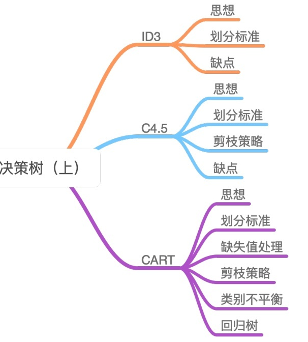

# Demo

## 概述

（该部分主要是简述算法由来，阐述背景等）

## 基本概念

（该部分主要是归纳算法涉及到的基本概念，例如，决策树，叶子节点，根节点等）

## 算法原理

（该部分主要是阐述算法构建过程、数学原理和公式、伪代码等）

## 算法示例

（该部分主要是写算例，结合算例更加清楚地说明算法原理）

## 算法代码

（该部分主要是写Python代码，注明代码实现的哪个具体公式，或是算法原理）

