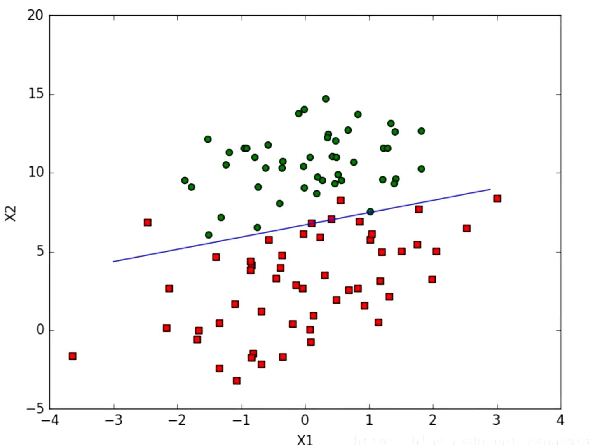

# 线性回归

## 一、什么是回归

回归是监督学习的一个重要问题，回归用于预测输入变量和输出变量之间的关系。回归模型是表示输入变量和输出变量之间映射的函数。
回归问题的学习等价于函数拟合：使用一条函数曲线使其能够很好的拟合已知函数并且能够很好的预测未知函数。
回归问题分为模型的学习和预测两个过程。基于给定的训练数据集构建一个模型，根据新的输入数据预测相应的输出。

## 二、一元线性回归

回归分析中只涉及到两个变量的，称为一元回归分析。一元回归的主要任务是从两个相关变量中的一个变量去估计另一个变量。被估计的变量称为因变量，可设为Y；估计出的变量，设为X。那么回归分析就是要找出一个数学模型Y=f(X)
             y=ax+b


### 算法具体举例

预测工资为15000时贷款的额度

| 编号 | 工资  | 额度  |
| ---- | ----- | ----- |
| 1    | 4000  | 20000 |
| 2    | 8000  | 50000 |
| 3    | 5000  | 30000 |
| 4    | 10000 | 70000 |
| 5    | 12000 | 60000 |
| 6    | 15000 | ？    |


把数据点标记出来，找出一条最合适的线来拟合所有的数据点。误差：真实值和预测值之间肯定存在差异，用ε来表示。那么对于每个样本有：yi=wxi+b+εi  

yi=wxi+b+εi    （1）

由于误差服从高斯分布：

在上述的式子中，我们并不知道参数w和b的具体值，所以由此引出似然函数。似然函数就是已知有样本，倒过来求解它的参数。下面给出似然函数，由于幂乘不好计算，我们两边取对数，就将幂乘变为累加，然后进行展开化简。


此时经过化简，我们可以看出化简后的式子是常数减去恒为正的式子我们的目标是使似然函数越大越好，那我们就要求下面这个式子最小时候的w和b的值。


要求w和b的值，就引出了最小二乘法。此时我们需要对w和b分别求其偏导数，使他们等于0，就可求出w和b的值。以下是具体的求导步骤：


此时我们将数据代入，便可求出了w的值为7.67，b的值为-100017.36

## 三、多元线性回归

在回归分析中，如果有两个或者两个以上的自变量，就称为多元回归


类比于刚才的一元线性回归，我们同样可以得出多元线性回归所要求得的目标函数，如下所示

同理我们仍需对目标函数进行求偏导，这其中涉及到矩阵的求导，具体过程如下所示：


由于这涉及到矩阵的逆，当X满秩时，才能求得唯一解。当其不满秩时有多个解，所以我们要求得最优解。因为我们要求得最优解，此时的最小二乘法已经完全不适用了。由此我们引出梯度下降算法来求得最优解。

梯度下降（gradient descent）在机器学习中应用十分的广泛，不论是在线性回归还是Logistic回归中，它的主要目的是通过迭代找到目标函数的最小值，或者收敛到最小值。梯度下降法的基本思想可以类比为一个下山的过程。
假设这样一个场景：一个人被困在山上，需要从山上下来(找到山的最低点，也就是山谷)。但此时山上的浓雾很大，导致可视度很低；因此，下山的路径就无法确定，必须利用自己周围的信息一步一步地找到下山的路。这个时候，便可利用梯度下降算法来帮助自己下山。**怎么做呢，首先以他当前的所处的位置为基准，寻找这个位置最陡峭的地方，然后朝着下降方向走一步，然后又继续以当前位置为基准，再找最陡峭的地方，再走直到最后到达最低处；同理上山也是如此，只是这时候就变成梯度上升算法了**

首先，我们有一个**可微分**的函数。这个函数就代表着一座山。我们的目标就是找到这个函数的最小值，也就是山底。根据之前的场景假设，最快的下山的方式就是找到当前位置最陡峭的方向，然后沿着此方向向下走，**对应到函数中，就是找到给定点的梯度** ，然后朝着梯度相反的方向，就能让函数值下降的最快！因为梯度的方向就是函数之变化最快的方向。我们重复利用这个方法，反复求取梯度，最后就能到达局部的最小值。

根据梯度下降，我们来看一下我们所要求得的目标函数：


其中α表示学习率也称为步长，当步长过大时迭代速度快，当步长过小时，迭代速度慢。然后我们来求一下梯度方向

批量梯度下降

对所有数据点，上述损失函数的偏导累计和为：

## 四、逻辑回归

逻辑回归分析是对定性变量的回归分析，前面所说的建立的模型描述是因变量的期望与自变量之间的线性关系。但是在许多实际问题中，我们需要研究的变量不是区间变量而是顺序变量或者名义变量。线性回归模型：

比如我们现在要研究致癌因素，包括年龄、性别、是否抽烟、饮食、是否喝酒等等。最终我们希望看到的Y=1（得癌症）Y=0（没得癌症），如果我们按照上页的线性回归模型建立的话，得到的值是连续的，不符合我们想要的0-1型变量。所以，我们不能用Ehat（Y）来预测因变量Y。但是因为Ehat（Y）肯定包含Y，所以对于0-1型变量：
E（Y）=P(Y=1)=P
我们可以用Ehat（Y）来预测Y=1的概率，其中ε为误差

概率与自变量之间的关系不是线性的，他们之间的关系往往是一个S型曲线。

我们可以通过对P进行一种变换（logit变换）使得p变到0-1之间：
logit(p)=ln(p/(1-p))
使得logit（p）与自变量之间存在线性相关的关系


经过变换解决了（2）式中概率的预测值可能是[0,1]之外的数的缺陷。经过（3）建立的模型，我们称之为逻辑回归模型。

z=w1x1+w2x2+.......+wnxn
z(i)=wTx(i)+b
i表示第i个样本点，y(i)表示第i个样本点预测为1的预测概率


逻辑回归模型得到的是关于P{Y=1|X}的预测概率，我们最终想要的是根据自变量的值来预测Y是0还是1。从而我们可以根据模型给出的Y=1的概率的大小来预测Y的取值。比如可以以0.5为界限，预测p大于0.5时，我们认为Y更有可能为1

接下来 我们要来看看如何求解系数，这里运用最大似然估计的方法。


设y是0-1型变量，x1,x2.....xk是与y相关的自变量，n组观测数据为（xi1,x12,....xik;yi）(i=1,2....n)

对数似然函数为：

对数似然函数的随机梯度为：


对数似然函数的随机梯度为：


Logisti回归参数β的求解过程为：


下述为逻辑回归的代码实现：

```
1 from numpy import *
2 filename='...\\testSet.txt' #文件目录
3 def loadDataSet():   #读取数据（这里只有两个特征）
4 dataMat = []
5 labelMat = []
6 fr = open(filename)
7 for line in fr.readlines():
8 lineArr = line.strip().split()
9 dataMat.append([1.0, float(lineArr[0]), float(lineArr[1])])   #前面的1，表示方程的常量。比如两个特征X1,X2，共需要三个参数，W1+W2*X1+W3*X2
10         labelMat.append(int(lineArr[2]))
11     return dataMat,labelMat
12 
13 def sigmoid(inX):  #sigmoid函数
14     return 1.0/(1+exp(-inX))
15 
16 def gradAscent(dataMat, labelMat): #梯度上升求最优参数
17     dataMatrix=mat(dataMat) #将读取的数据转换为矩阵
18     classLabels=mat(labelMat).transpose() #将读取的数据转换为矩阵
19     m,n = shape(dataMatrix)
20     alpha = 0.001  #设置梯度的阀值，该值越大梯度上升幅度越大
21     maxCycles = 500 #设置迭代的次数，一般看实际数据进行设定，有些可能200次就够了
22     weights = ones((n,1)) #设置初始的参数，并都赋默认值为1。注意这里权重以矩阵形式表示三个参数。
23     for k in range(maxCycles):
24         h = sigmoid(dataMatrix*weights)
25         error = (classLabels - h)     #求导后差值
26         weights = weights + alpha * dataMatrix.transpose()* error #迭代更新权重
27     return weights
28 
29 def stocGradAscent0(dataMat, labelMat):  #随机梯度上升，当数据量比较大时，每次迭代都选择全量数据进行计算，计算量会非常大。所以采用每次迭代中一次只选择其中的一行数据进行更新权重。
30     dataMatrix=mat(dataMat)
31     classLabels=labelMat
32     m,n=shape(dataMatrix)
33     alpha=0.01
34     maxCycles = 500
35     weights=ones((n,1))
36     for k in range(maxCycles):
37         for i in range(m): #遍历计算每一行
38             h = sigmoid(sum(dataMatrix[i] * weights))
39             error = classLabels[i] - h
40             weights = weights + alpha * error * dataMatrix[i].transpose()
41     return weights
42 
43 def stocGradAscent1(dataMat, labelMat): #改进版随机梯度上升，在每次迭代中随机选择样本来更新权重，并且随迭代次数增加，权重变化越小。
44     dataMatrix=mat(dataMat)
45     classLabels=labelMat
46     m,n=shape(dataMatrix)
47     weights=ones((n,1))
48     maxCycles=500
49     for j in range(maxCycles): #迭代
50         dataIndex=[i for i in range(m)]
51         for i in range(m): #随机遍历每一行
52             alpha=4/(1+j+i)+0.0001  #随迭代次数增加，权重变化越小。
53             randIndex=int(random.uniform(0,len(dataIndex)))  #随机抽样
54             h=sigmoid(sum(dataMatrix[randIndex]*weights))
55             error=classLabels[randIndex]-h
56             weights=weights+alpha*error*dataMatrix[randIndex].transpose()
57             del(dataIndex[randIndex]) #去除已经抽取的样本
58     return weights
59 
60 def plotBestFit(weights):  #画出最终分类的图
61     import matplotlib.pyplot as plt
62     dataMat,labelMat=loadDataSet()
63     dataArr = array(dataMat)
64     n = shape(dataArr)[0]
65     xcord1 = []; ycord1 = []
66     xcord2 = []; ycord2 = []
67     for i in range(n):
68         if int(labelMat[i])== 1:
69             xcord1.append(dataArr[i,1])
70             ycord1.append(dataArr[i,2])
71         else:
72             xcord2.append(dataArr[i,1])
73             ycord2.append(dataArr[i,2])
74     fig = plt.figure()
75     ax = fig.add_subplot(111)
76     ax.scatter(xcord1, ycord1, s=30, c='red', marker='s')
77     ax.scatter(xcord2, ycord2, s=30, c='green')
78     x = arange(-3.0, 3.0, 0.1)
79     y = (-weights[0]-weights[1]*x)/weights[2]
80     ax.plot(x, y)
81     plt.xlabel('X1')
82     plt.ylabel('X2')
83     plt.show()
84 
85 def main():
86     dataMat, labelMat = loadDataSet()
87     weights=gradAscent(dataMat, labelMat).getA()
88     plotBestFit(weights)
89 
90 if __name__=='__main__':
91     main()

```

以下为用到的数据集：

```
1 -0.017612   14.053064   0
  2 -1.395634   4.662541    1
  3 -0.752157   6.538620    0
  4 -1.322371   7.152853    0
  5 0.423363    11.054677   0
  6 0.406704    7.067335    1
  7 0.667394    12.741452   0
  8 -2.460150   6.866805    1
  9 0.569411    9.548755    0
 10 -0.026632   10.427743   0
 11 0.850433    6.920334    1
 12 1.347183    13.175500   0
 13 1.176813    3.167020    1
 14 -1.781871   9.097953    0
 15 -0.566606   5.749003    1
 16 0.931635    1.589505    1
 17 -0.024205   6.151823    1
 18 -0.036453   2.690988    1
 19 -0.196949   0.444165    1
 20 1.014459    5.754399    1
 21 1.985298    3.230619    1
 22 -1.693453   -0.557540   1
 23 -0.576525   11.778922   0
 24 -0.346811   -1.678730   1
 25 -2.124484   2.672471    1
 26 1.217916    9.597015    0
 27 -0.733928   9.098687    0
 28 -3.642001   -1.618087   1
 29 0.315985    3.523953    1
 30 1.416614    9.619232    0
 31 -0.386323   3.989286    1
 32 0.556921    8.294984    1
 33 1.224863    11.587360   0
 34 -1.347803   -2.406051   1
 35 1.196604    4.951851    1
 36 0.275221    9.543647    0
 37 0.470575    9.332488    0
 38 -1.889567   9.542662    0
 39 -1.527893   12.150579   0
 40 -1.185247   11.309318   0
 41 -0.445678   3.297303    1
 42 1.042222    6.105155    1
 43 -0.618787   10.320986   0
 44 1.152083    0.548467    1
 45 0.828534    2.676045    1
 46 -1.237728   10.549033   0
 47 -0.683565   -2.166125   1
 48 0.229456    5.921938    1
 49 -0.959885   11.555336   0
 50 0.492911    10.993324   0
 51 0.184992    8.721488    0
 52 -0.355715   10.325976   0
 53 -0.397822   8.058397    0
 54 0.824839    13.730343   0
 55 1.507278    5.027866    1
 56 0.099671    6.835839    1
 57 -0.344008   10.717485   0
 58 1.785928    7.718645    1
 59 -0.918801   11.560217   0
 60 -0.364009   4.747300    1
 61 -0.841722   4.119083    1
 62 0.490426    1.960539    1
 63 -0.007194   9.075792    0
 64 0.356107    12.447863   0
 65 0.342578    12.281162   0
 66 -0.810823   -1.466018   1
 67 2.530777    6.476801    1
 68 1.296683    11.607559   0
 69 0.475487    12.040035   0
 70 -0.783277   11.009725   0
 71 0.074798    11.023650   0
 72 -1.337472   0.468339    1
 73 -0.102781   13.763651   0
 74 -0.147324   2.874846    1
 75 0.518389    9.887035    0
 76 1.015399    7.571882    0
 77 -1.658086   -0.027255   1
 78 1.319944    2.171228    1
 79 2.056216    5.019981    1
 80 -0.851633   4.375691    1
 81 -1.510047   6.061992    0
 82 -1.076637   -3.181888   1
 83 1.821096    10.283990   0
 84 3.010150    8.401766    1
 85 -1.099458   1.688274    1
 86 -0.834872   -1.733869   1
 87 -0.846637   3.849075    1
 88 1.400102    12.628781   0
 89 1.752842    5.468166    1
 90 0.078557    0.059736    1
 91 0.089392    -0.715300   1
 92 1.825662    12.693808   0
 93 0.197445    9.744638    0
 94 0.126117    0.922311    1
 95 -0.679797   1.220530    1
 96 0.677983    2.556666    1
 97 0.761349    10.693862   0
 98 -2.168791   0.143632    1
 99 1.388610    9.341997    0
100 0.317029    14.739025   0
```

运行结果：



参考资源：

[https://www.cnblogs.com/luozeng/p/8605140.html]: 
[https://blog.csdn.net/qq_41800366/article/details/86583789]: 
[https://www.bilibili.com/video/BV1mE411u732?from=search&amp;seid=8844989253256453796]: 

