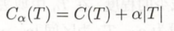

# cart算法


## 概述

​		决策树(Decision Tree）是在已知各种情况发生概率的基础决策分析方法，是直观运用概率分析的一种图解法。由于这种决策分支画成图形很像一棵树的枝干，故称决策树。在机器学习中，决策树是一个预测模型，它代表的是对象属性与对象值之间的一种映射关系。Entropy = 系统的凌乱程度，使用算法ID3,C4.5和C5.0生成树算法使用熵。这一度量是基于信息学理论中熵的概念。

​		决策树是一种树形结构，其中每个内部节点表示一个属性上的测试，每个分支代表一个测试输出，每个叶节点代表一种类别。

​		决策树是在二叉树的基础上经过更精细的发展得出的，是一种常见的机器学习方法。一颗决策树包含一个根结点、若干个内部结点和若干个叶子节点，叶子结点对应于接测结果，其他每个结点则对应于一个属性测试。每个结点包含的样本集合根据属性测试的结果被划分到子结点中，根结点包含样本全集。从根结点到每个叶子结点的滤镜对应了一个判定测试序列，决策树学习的目的是为了产生一棵泛化能力强，即处理未见示例能力强的决策树。决策树的生成是一个递归过程。在决策树基本算法中，有三种情形会导致递归返回：（1）当前结点包含的样本属于同一类别，无需划分。（2）当前属性集为空，或是所有样本在所有属性上取值相同，无法划分，（3）当前结点包含的样本集合为空，不能划分。

​		优点：计算复杂度不高，输出结果易于理解，对中间值的缺失不敏感，可以处理不相关特征数据。

​		缺点：可能会产生过渡匹配问题

​		cart是1984年由Breiman，Friedman，Olshen，Stone提出的一个决策树算法。随机森林是通过将很多的决策树组合而成的，随机森林采用cart算法。基尼系数是Breiman于1984年提出的，主要用在cart算法中。

## 基本概念

cart算法：

​		cart算法是决策树的一种常用算法，与ID3算法和C4.5算法类似，只不过将信息熵和信息增益改成了基尼系数。

​		基尼系数反映了从数据集中随机抽取了两个样本，其类别标记不一致的概率。因此，基尼系数越小，则数据集的纯度越高。若基尼系数等于1，则数据自由度非常高；若基尼系数等于0，则数据的自由度非常低。

​		与信息熵和信息增益，基尼系数的纯度更高。

​		下图为二类分类中基尼系数、熵之半和分类误差的关系 


​		树剪枝：一棵树如果结点过多，表明该模型可能对数据进行了“过拟合”。通过降低决策树的复杂度来避免过拟合的过程称为剪枝。剪枝的方法有两种，一种是预剪枝，一种是后剪枝。预剪枝是调整数据集来防止过拟合，后剪枝是先建树，去掉损失函数比较低的分支。

Cart算法由以下两步组成：

（1）决策树生成：基于训练数据集生成决策树，生成的决策树要尽量大。

（2）决策树剪枝：用验证数据集与已生成的数进行剪枝并选择最优子树，这是用损失函数最小作为剪枝的标准。

​		

## 算法原理

​		基尼系数：在cart算法中，基尼不纯度表示一个随机选中的样本在子集中被分错的可能性。基尼不纯度为这个样本被选中的概率乘以它被分错的概率。

​		

损失函数：

​			C（T）为对训练数据的预测误差，|T|为子树的叶子结点的个数。最终结果是在参数α下子树T的整体损失。

​					

​			Tt为根结点为t的子树，该函数计算的是以t为根结点的子树的损失值。

​						

​			C（t）表示t结点的单个节点损失值，C（Tt）表示以t结点为根结点的子树的整体损失值。一般来说，C（t）>  C（Tt）。


​		cart构建过程：（1）收集数据：可以使用任何方法。

​							（2）准备数据：树构造算法只适用于标称型数据，因袭数值型数据必须离散化。

​							（3）分析数据：可以使用任何方法，构造树完成之后，我们应该检查图形是否符合预期。

​							（4）训练数据：构造树的数据结构。

​							（3）测算数据：使用经验树计算错误率。

​							（3）使用算法：此步骤可以适用于任何监督学习算法，而使用决策树可以更好地理解数据的内在含义。


Cart生成算法：

 输入：训练数据集D，停止计算的条件。

 输出：cart决策树。

 （1）设结点的训练数据集为D，计算现有特征对该数据集的基尼系数。此时，对每一个特征A，对其可能取的每个值a，根据样本点对A=a的测试为“是”或“否”将D分割成D1和D2两部分，计算基尼系数。

 （2）在所有可能的特征A以及它们所有可能的切分点a中，选择基尼系数最小的特征及其对应的切分点作为最优特征与最优切分点。依最优特征与最优切分点，从现结点生成两个子结点，将训练数据集依特征分配到两个子结点中去。

  （3）对两个子结点递归地调用（1），（2），直至满足停止条件。

 （4）生成cart决策树。


​		cart剪枝算法：

​		输入：cart算法生成的决策树T0。

​		输出：最优决策树Tα。

​	（1）设k=0，T=T0.

​	（2）设α=+∞。

​	（3）自下而上地对各内部结点t计算C（Tt），|Tt|以及	α=min(α,g(t))，这里Tt表示以t为根结点的子树，C（Tt）是对训练数据的预测误差，|Tt|是Tt的叶子结点个数。

​	（4）对g（t）=α的内部结点t进行剪枝，并对叶结点t以多数表决法决定其类，得到树T。

​	（5）设k=k+1，αk=α，Tk=T。

​	（6）如果Tk不是由根结点及两个叶结点构成的数，则回到步骤（2）；否则令Tk=Tn。

​	（7）采用交叉验证法在子树序列T0，T1，……，Tn中选取最优子树Tα。


伪代码：

```python
def createTree():
    找到最佳的待切分特征：
        如果该节点不能再分，将该节点存为叶子结点
        执行二元切分
        在右子树调用careateTree（）方法
        在左子树调用careateTree（）方法
```

```python
def createBranch():
    检测数据集中的每个子项是否属于同一分类：
    if so return 类标签;
    else 
        寻找划分数据集的最好特征
        划分数据集
        创建分支节点
            for 每个划分的子集
                调用函数careateBranch并增加返回结果到分支节点中
        return 分支节点
```

```python
def prune（）：
    基于已有的树切分测试数据：
        如果存在任一子集是一棵树，则在该子集递归剪枝过程
        计算将当前两个叶节点合并后的误差
        计算不合并的误差
        如果合并会降低误差的话，就将叶节点合
```

## 算法示例

（该部分主要是写算例，结合算例更加清楚地说明算法原理）

选择最好的特征进行分离。

当只有一个特征时，因为数据的自由度足够的低，所以没必要进行分离。当特征数大于一时，则遍历整个数据集的属性，去掉重复的属性。然后经过计算不同的属性的基尼系数，对比出基尼系数最小的属性进行分支。

```python
def chooseBestFeatureToSplit(dataSet):
    numFeatures = len(dataSet[0]) - 1
    if numFeatures == 1:
        return 0
    bestGini = 1
    bestFeature = -1
    for i in range(numFeatures):
        uniqueVals = set(example[i] for example in dataSet)
        feaGini = 0
        for value in uniqueVals:
            subDataSet = splitDataSet(dataSet, i, value)
            prob = len(subDataSet) / float(len(dataSet))
            probabilityEnt = calcProbabilityEnt(subDataSet)
            feaGini += prob * (2 * probabilityEnt * (1 - probabilityEnt))
        if (feaGini < bestGini):
            bestGini = feaGini
            bestFeature = i
    return bestFeature
```

根据特征个数的情况，对特征情况进行分类。选择最优的特征，将最优特征作为整个树产生分支的一个结点。之后不断递归调用自身，完成建树。

```python
def createTree(dataSet, labels):
    classList = [example[-1] for example in dataSet]
    if classList.count(classList[0]) == len(classList):
        return classList[0]
    if len(dataSet[0]) == 1:
        return majorityCnt(classList)
    bestFeat = chooseBestFeatureToSplit(dataSet)
    bestFeatLabel = labels[bestFeat]
    del (labels[bestFeat])
    uniqueVals = set(example[bestFeat] for example in dataSet)
    myTree = {bestFeatLabel: {}}
    for value in uniqueVals:
        subLabels = labels[:]
        myTree[bestFeatLabel][value] = createTree(splitDataSet(dataSet, bestFeat, value), subLabels)
    return myTree
```

## 算法代码

（该部分主要是写Python代码，注明代码实现的哪个具体公式，或是算法原理）

```python
from math import log
import operator

def createDataSet1():
    """
    创造示例数据/读取数据
    @param dataSet: 数据集
    @return dataSet labels：数据集 特征集
    """
    # 数据集
    dataSet = [('青年', '否', '否', '一般', '不同意'),
               ('青年', '否', '否', '好', '不同意'),
               ('青年', '是', '否', '好', '同意'),
               ('青年', '是', '是', '一般', '同意'),
               ('青年', '否', '否', '一般', '不同意'),
               ('中年', '否', '否', '一般', '不同意'),
               ('中年', '否', '否', '好', '不同意'),
               ('中年', '是', '是', '好', '同意'),
               ('中年', '否', '是', '非常好', '同意'),
               ('中年', '否', '是', '非常好', '同意'),
               ('老年', '否', '是', '非常好', '同意'),
               ('老年', '否', '是', '好', '同意'),
               ('老年', '是', '否', '好', '同意'),
               ('老年', '是', '否', '非常好', '同意'),
               ('老年', '否', '否', '一般', '不同意')]
    # 特征集
    labels = ['年龄', '有工作', '有房子', '信贷情况']
    return dataSet, labels

def calcProbabilityEnt(dataSet):
    """
    样本点属于第1个类的概率p，即计算2p(1-p)中的p
    @param dataSet: 数据集
    @return probabilityEnt: 数据集的概率
    """
    numEntries = len(dataSet)  # 数据条数
    feaCounts = 0
    fea1 = dataSet[0][len(dataSet[0]) - 1]
    for featVec in dataSet:  # 每行数据
        if featVec[-1] == fea1:
            feaCounts += 1
    probabilityEnt = float(feaCounts) / numEntries
    return probabilityEnt

def splitDataSet(dataSet, index, value):
    """
    划分数据集，提取含有某个特征的某个属性的所有数据
    @param dataSet: 数据集
    @param index: 属性值所对应的特征列
    @param value: 某个属性值
    @return retDataSet: 含有某个特征的某个属性的数据集
    """
    retDataSet = []
    for featVec in dataSet:
        # 如果该样本该特征的属性值等于传入的属性值，则去掉该属性然后放入数据集中
        if featVec[index] == value:
            reducedFeatVec = featVec[:index] + featVec[index + 1:]  # 去掉该属性的当前样本
            retDataSet.append(reducedFeatVec)  # append向末尾追加一个新元素，新元素在元素中格式不变，如数组作为一个值在元素中存在
    return retDataSet

def chooseBestFeatureToSplit(dataSet):
    """
    选择最优特征
    @param dataSet: 数据集
    @return bestFeature: 最优特征所在列
    """
    numFeatures = len(dataSet[0]) - 1  # 特征总数（每个示例有五个特征，去掉最后一个不算，有四个特征）numFeatures=4
    if numFeatures == 1:  # 当只有一个特征时
        return 0
    bestGini = 1  # 最佳基尼系数
    bestFeature = -1  # 最优特征
    for i in range(numFeatures):
        uniqueVals = set(example[i] for example in dataSet)  # 去重，每个属性值唯一（每个示例的属性都被遍历一次）
        feaGini = 0  # 定义特征的值的基尼系数
        # 依次计算每个特征的值的熵
        for value in uniqueVals:
            subDataSet = splitDataSet(dataSet, i, value)  # 根据该特征属性值分的类
            # 参数：原数据、循环次数(当前属性值所在列)、当前属性值
            prob = len(subDataSet) / float(len(dataSet))    # 参数权重
            probabilityEnt = calcProbabilityEnt(subDataSet)
            feaGini += prob * (2 * probabilityEnt * (1 - probabilityEnt))   # 计算基尼系数（二分类问题）
        if (feaGini < bestGini):  # 基尼系数越小越好，挑选基尼系数小最的特征
            bestGini = feaGini
            bestFeature = i
    return bestFeature

def majorityCnt(classList):
    """
    对最后一个特征分类，出现次数最多的类即为该属性类别，比如：最后分类为2男1女，则判定为男
    @param classList: 数据集，也是类别集
    @return sortedClassCount[0][0]: 该属性的类别
    """
    classCount = {}
    # 计算每个类别出现次数
    for vote in classList:
        try:
            classCount[vote] += 1
        except KeyError:
            classCount[vote] = 1
    sortedClassCount = sorted(classCount.items(), key=operator.itemgetter(1), reverse=True)  # 出现次数最多的类别在首位
    # 对第1个参数，按照参数的第1个域来进行排序（第2个参数），然后反序（第3个参数）
    return sortedClassCount[0][0]  # 该属性的类别

def createTree(dataSet, labels):
    """
    对最后一个特征分类，按分类后类别数量排序，比如：最后分类为2同意1不同意，则判定为同意
    @param dataSet: 数据集
    @param labels: 特征集
    @return myTree: 决策树
    """
    classList = [example[-1] for example in dataSet]  # 获取每行数据的最后一个值‘是否同意’，即每行数据的类别
    # 当数据集只有一个类别
    if classList.count(classList[0]) == len(classList):
        return classList[0]
    # 当数据集只剩一列（即类别），即根据最后一个特征分类
    if len(dataSet[0]) == 1:
        return majorityCnt(classList)
    # 其他情况
    bestFeat = chooseBestFeatureToSplit(dataSet)  # 选择最优特征（所在列）
    bestFeatLabel = labels[bestFeat]  # 最优特征
    del (labels[bestFeat])  # 从特征集中删除当前最优特征
    uniqueVals = set(example[bestFeat] for example in dataSet)  # 选出最优特征对应属性的唯一值
    myTree = {bestFeatLabel: {}}  # 分类结果以字典形式保存
    for value in uniqueVals:
        subLabels = labels[:]  # 深拷贝，拷贝后的值与原值无关（普通复制为浅拷贝，对原值或拷贝后的值的改变互相影响）
        myTree[bestFeatLabel][value] = createTree(splitDataSet(dataSet, bestFeat, value), subLabels)  # 递归调用创建决策树
    return myTree

if __name__ == '__main__':
    dataSet, labels = createDataSet1()  # 创造示列数据
    print(createTree(dataSet, labels))
```