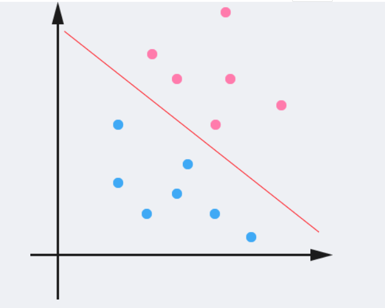
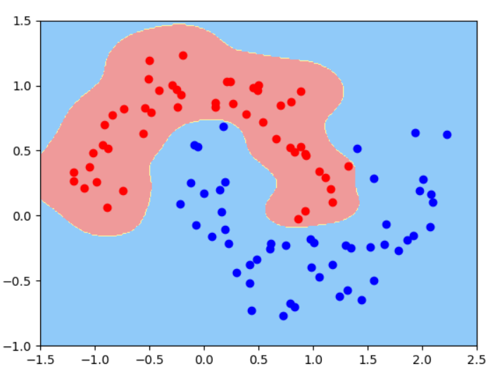
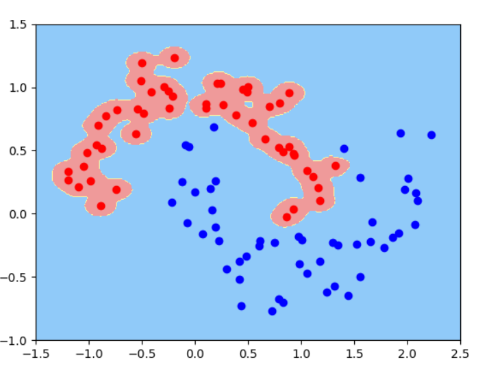

# SVM #


# 1.概述

SVM的英文全称是Support Vector Machines，中文叫支持向量机。它是一种有监督的学习算法，可用于分类或回归问题。SVM相对于其他分类算法，最大的好处就是它可以引入核函数，可以进行非线性分类。

# 2.基本概念

如下图，在二维空间中，两类点被一条直线完全分开叫做线性可分。




将数据集分隔开来的直线称为**分隔超平面**（separating hyperplane）。在上面给出的例子中，由于数据点都在二维平面上，所以此时分隔超平面就只是一条直线。但是，如果所给的数据集是三维的，那么此时用来分隔数据的就是一个平面。显而易见，更高维的情况可以依此类推。如果数据集是1024维的，那么就需要一个1023维的某对象来对数据进行分隔。这个1023维的某对象到底应该叫什么？N-1维呢？该对象被称为**超平面**（hyperplane），也就是分类的决策边界。分布在超平面一侧的所有数据都属于某个类别，而分布在另一侧的所有数据则属于另一个类别。

但是线性可分的数据集，可能有无数个分隔超平面。如下图，两种都可以把数据集分开，但是他们的分隔效果是一样的吗？显然第一个的分类效果是更好的，因为它具体更好的鲁棒性或者说健壮性。怎么理解鲁棒性，就是犯错误的几率小，也就是当新加进来一个点，能把新的点分类正确的可能性更大。


我们希望找到离分隔超平面近的点，确保它们离分隔面的距离尽可能远。这里点到分隔面的距离被称为**间隔**（margin）。我们希望间隔尽可能地大，这是因为如果我们犯错或者在有限数据上训练分类器的话，我们希望分类器尽可能健壮。**支持向量**（support vector）就是离分隔超平面近的那些点。由支持向量构成的平面为**决策边界**。SVM就是要找到支持向量并最大化间隔。

**函数间隔**和**几何间隔**：
一般来说，一个点距离分隔超平面的远近可以表示分类预测的确信程度。在超平面wx+b=0确定的情况下，|wx+b|能够相对地表示点x距离超平面的远近。而wx+b的符号和标记y的符号能否一致表示分类的正确性。所以可以用y(wx+b)来表示分类的正确性和确信度，这就是函数间隔的概念。
在逻辑回归中，y有0和1，而在这里，我们用1和-1来表示分类结果。为什么用1和-1呢。在二分类中，我们假定，当wx+b>0时，分类结果为1，wx+b<0时，分类结果为-1。这样的话，如果分类正确，y(wx+b)>0，且值越大确信度越高，如果分类错误，y(wx+b)<0，绝对值越大错的就越离谱。

**函数间隔**：对于给定的训练数据集T和超平面(w,b)，定义超平面(w,b)关于样本点(xi,yi)的函数间隔为:


定义超平面(w,b)关于训练集T的函数间隔为超平面(w,b)关于T中所有样本点的(xi,yi)的函数间隔最小值，即:


**几何间隔**：对于给定的训练数据集T和超平面(w,b)，定义超平面(w,b)关于样本点(xi,yi)的几何间隔为:


定义超平面(w,b)关于训练集T的函数间隔为超平面(w,b)关于T中所有样本点的(xi,yi)的函数间隔最小值，即:


可以类比二维空间中点到直线距离公式理解：


函数间隔和几何间隔的关系可以表示如下:


**如果等比例改变w和b，超平面不变，函数间隔改变，几何间隔不变。**

# 3.算法原理

## 3.1最大化间隔问题


根据支持向量的定义我们知道，支持向量到超平面的距离为 d，其他点到超平面的距离大于 d，于是有：


两边除以d，得到：


我们已经知道，改变w和b对我们的分隔超平面wx+b是没有影响的，所以这里令wT=wT/||w||d，b=b/||w||d，则化为：


合并两个方程则为：


在支持向量上，不等式即为等式，即y(WTx + b)=1，这就是决策边界。如下图：


我们的几何间距也可以表示为：


因为在支持向量上，分子为1，因此：


最大化d等价于最小化：


因此，求解最大间隔问题可以转化为下面的最优化问题：


## 3.2 拉格朗日乘子法和KKT条件

上面我们已经得到了最大化间隔的优化问题，接下来如何求解呢？那就要用到拉格朗日乘子法了。由于涉及大量的数学优化知识，这里也可以省去，直接看结论，会用结论就可以满足我们求解SVM优化问题了。
拉格朗日函数主要用来求解带约束的优化问题，常见的优化问题有如下三种：
1.无约束优化问题


这类问题常常使用的方法就是Fermat定理，即使用求取f(x)的导数，然后令其为零，可以求得候选最优值，再在这些候选值中验证；如果是凸函数，可以保证是最优解。

2.有等式约束的优化问题


这类问题常用的方法为拉格朗日乘子法，构造拉格朗日函数：


其中αi 为拉格朗日乘子。然后分别对x 和α=(α1,…,αm)T求导并令导数为0：


3.不等式约束的优化问题


构造拉格朗日函数：


为了求出最优值，必须满足必要条件，就是**KKT条件**：

- 条件一：经过拉格朗日函数处理之后的新目标函数L(w,b,α)对x求导为零
- 条件二：h(x) = 0
- 条件三：α*g(x) = 0

**对偶问题**：
我们先定义对偶函数：


即对偶函数就是原问题对x最小化后关于α和β的函数。
则原问题的对偶问题为：


即原问题的对偶问题就是先求原问题关于x的最小值，再求关于α和β的的最大值。
对偶问题的解d与原问题的解p满足如下关系：


即对偶问题的解是原问题解的下确界。
**这里有很重要一个结论**：在KKT条件下，如果f(x)是凸函数，此时具有**强对偶性**，即等式成立，原问题的最优解等于对偶问题的最优解。因此我们**可以通过求解对偶问题来求解原问题**。

## 3.3 硬间隔最大化

我们已经知道SVM优化问题如下：


为了写出拉格朗日函数，把不等式条件转化为小于等于，我们把问题写为：


1.构造拉格朗日函数


其中 αi 为拉格朗日乘子，且 αi>=0。

2.利用强对偶性转化


3.对参数w和b求偏导为0
求解凸函数的最小值，就是偏导为0的点。省去中间求解过程，得到最后结果为：


把上述结果带到原拉格朗日函数中，消去w和b：


也即：


即拉格朗日函数对w和b求最小值后得到的结果。
则我们的对偶问题现在就是


也即：


使用序列最小优化(SMO)算法得到α*，是一个αi组成的n维向量。

4.求解w和b
根据α*，我们就可以求解出w和b。
根据前面偏导为0的推导，我们得到了：


由此可以求出w*。

由KKT条件可知:


因此可以知道，在α*中至少存在一个αj>0（反证法可以证明，若全为0，则 w=0，这里w是指所有的参数wi组成的向量，矛盾）。对此 j有：


则:


5.求得分隔超平面和决策函数
所以最后得到分隔超平面：


分类决策函数：


其中sign()为越阶函数：


## 3.4 软间隔最大化

在实际应用中，完全线性可分的样本是很少的，如果遇到了不能够完全线性可分的样本，就要用到我们的软间隔了。相比于硬间隔的苛刻条件，我们允许个别样本点出现在间隔带里面，如下图：


此时可以允许部分样例点不满足约束条件：


引入一个松弛变量ξi，令ξi>=0，则有：


如下图所示：


优化目标变成:


**其中 C 是一个大于 0 的常数，可以理解为错误样本的惩罚程度，若 C 为无穷大，ξi 必然无穷小，如此一来线性 SVM 就又变成了线性可分 SVM；当 C 为有限值的时候，才会允许部分样本不遵循约束条件**。

同样这里先用拉格朗日乘子法得到拉格朗日函数，再求其对偶问题。这里省去中间过程，得到最后的对偶问题为：


然后同样求解w和b：


所以最后得到分隔超平面:


分类决策函数：


## 3.5 核函数

但有时会碰到样本点不是线性可分的，如：


此时需要将二维线性不可分样本映射到高维空间中，样本点在高维空间线性可分，如：


由地空间向高纬度空间映射，可能会造成计算量太大。但如果我们有这样的一核函数K(x,z)=φ(x)·φ(z)，xi和xj在特征空间的内积等于它们在原始样本空间中通过函数 K(xi,xj)计算的结果，我们就不需要计算高维甚至无穷维空间的内积了。**就是用核函数代替高维內积**。

求解步骤如下：

1.选取适当的核函数K(x,z)和惩罚参数C>0。构造并求解凸二次规划问题


2.计算w和b


3.分类决策函数


**常见的核函数**：

1.线性核函数


2.多项式核函数


3.高斯核函数


# 4.算法示例

## 4.1 SVM处理回归问题 -- 预测波斯顿房价

svm处理回归问题的核心是我们只需要让所有样本点到我们找到的超平面距离之和最短即可。

代码如下：

```python
import numpy as np
import matplotlib.pyplot as plt
from sklearn import datasets

boston = datasets.load_boston()

x = boston.data
y = boston.target

from sklearn.model_selection import train_test_split

x_train,x_test,y_train,y_test = train_test_split(x,y,random_state = 666)
from sklearn.svm import LinearSVR#linerSVC用于处理分类问题，这个用于处理回归问题
from sklearn.svm import SVR
from sklearn.preprocessing import StandardScaler
from sklearn.pipeline import Pipeline


def StandardLinearSVR(epsilon = 1):
    return Pipeline([
        ("std_scaler",StandardScaler()),
        ("linearSVR",LinearSVR(epsilon = epsilon))#还有一个超参数C，这里使用默认值
    ])

svr = StandardLinearSVR()
svr.fit(x_train,y_train)
svr.score(x_test,y_test)
```


# 5. 算法代码

## 5.1 硬间隔最大化代码

```python
import numpy as np
import matplotlib.pyplot as plt
from sklearn import datasets


iris = datasets.load_iris()#加载鸢尾花数据集,一共有四个特征

x = iris.data#将特征值赋值给x
y = iris.target#标记赋值给y，y一共有三个值0，1，2

x = x[y<2,:2]#取前两个特征
y = y[y<2]#只取特征值 0和1

from sklearn.preprocessing import StandardScaler#导入标准化的包
standardScaler =StandardScaler()#实例化一个StandardScaler对象
standardScaler.fit(x)#训练样本x ，计算训练数据x的样本和方差
x_standard = standardScaler.transform(x)#把x转成服从标准正态分布，标准化训练数据
# print(x_standard)

from sklearn.svm import LinearSVC
svc = LinearSVC(C = 1000)#C为惩罚参数，当C很大时，就为硬间隔，适中时为软间隔
svc.fit(x_standard,y)#训练样本数据
#print(svc.coef_)
#print(svc.intercept_)


#决策边界绘制函数
def plot_decision_boundary(model , axis):#axis的0123代表x轴和y轴的范围
    #使用np.meshgrid将x0和x1转换成网格数据
    x0,x1 = np.meshgrid(
        np.linspace(axis[0],axis[1],int((axis[1] - axis[0]) * 100)).reshape(-1, 1),#（-1，1）表示（任意行，一列）
        np.linspace(axis[2],axis[3],int((axis[3] - axis[2]) * 100)).reshape(-1, 1)
    )#对x轴和y轴划分点    用x轴的最大值减去最小值再乘以100，【起始位置，终止位置，元素个数】
    x_new = np.c_[x0.ravel(),x1.ravel()]#raval将多维数组降为一维，np.c_是按行连接两个矩阵，就是把两矩阵合并，重新布置矩阵
    y_predict = model.predict(x_new)#对所有的点进行预测
    zz = y_predict.reshape(x0.shape)#把y_predict改成x0.shape的类型并赋值给zz，将zz也转换成网格数据
    # print(zz.shape)
    from matplotlib.colors import ListedColormap
    custom_cmap = ListedColormap([ '#EF9A9A', '#FFF59D','#90CAF9'])
    plt.contourf(x0,x1,zz, cmap = custom_cmap)#在这个函数中输入的参数是x,y对应的网格数据以及此网格对应的高度值

    w = model.coef_[0]#参数w的向量
    b = model.intercept_[0]#截距b的向量
    # wO * x0 + w1 * x1 + b = 0
    # x1 = -w0 / w1 * x0 - b / w1#每有一个x0，就能算出一个x1
    plot_x =np.linspace(axis[0],axis[1],200)
    #分别计算上下两条线中对应的y轴上的的值，不是标记+1，-1
    up_y = -w[0]/w[1] * plot_x - b/w[1] + 1/w[1]
    down_y = -w[0] / w[1] * plot_x - b / w[1] - 1 / w[1]
    #筛选掉y值超过坐标轴范围的点
    up_index = (up_y >= axis[2]) & (up_y <= axis[3])
    down_index = (down_y >= axis[2]) & (down_y <= axis[3])
    plt.plot(plot_x[up_index], up_y[up_index], color="black")
    plt.plot(plot_x[down_index], down_y[down_index], color="black")

plot_decision_boundary(svc,axis= [-3,3,-3,3])
plt.scatter(x_standard[y==0,0],x_standard[y==0,1],color = 'r')#x[0,:]表示取矩阵x中的第0行全部元素
plt.scatter(x_standard[y==1,0],x_standard[y==1,1],color = 'g')#打印y=1的点

#若不标准化数据

#plt.scatter(x[y==0,0],x[y==0,1],color = 'r')#x[0,:]表示取矩阵x中的第0行全部元素
#plt.scatter(x[y==1,0],x[y==1,1],color = 'g')#打印y=1的点

plt.show()
```


## 5.2 软间隔最大化代码

软间隔最大化时，只需要修改LinearSVC(C=100)中惩罚参数C的值，当C很大时，为硬间隔，当C取值适当时，即为软间隔。

下图为当C = 1时的图像


## 5.3 高斯核函数代码


```python
import numpy as np
import matplotlib.pyplot as plt
from sklearn import datasets

x,y = datasets.make_moons(noise= 0.15,random_state= 666)#
# print(x)
# print(y)
# plt.scatter(x[y==0,0],x[y==0,1])
# plt.scatter(x[y==1,0],x[y==1,1])
# plt.show()

from sklearn.preprocessing import StandardScaler
from sklearn.svm import SVC
from sklearn.pipeline import Pipeline


def RBFKernelSVC(gamma=1.0):
    return Pipeline([
        ("std_scaler", StandardScaler()),
        ("svc", SVC(kernel="rbf", gamma=gamma))#gamma越小，高斯分布越宽，gamma相当于调整模型的复杂度，gamma值越小模型复杂度越低，gamma值越高，模型复杂度越大
    ])

    # std_scaler = StandardScaler()
    # SVC = SVC(kernel = "rbf",gamma = gamma)
    # pipeline = Pipeline([('std_scaler',std_scaler),('SVC', SVC)])
    # return pipeline
svc = RBFKernelSVC(gamma = 10.0)
svc.fit(x,y)

def plot_decision_boundary(model, axis):#axis的0123对应x轴和y轴的范围
    #使用np.meshgrid将x0和x1转换成网格数据
    x0, x1 = np.meshgrid(
        np.linspace(axis[0], axis[1], int((axis[1]-axis[0])*100)).reshape(-1, 1),
        np.linspace(axis[2], axis[3], int((axis[3]-axis[2])*100)).reshape(-1, 1)#（-1，1）表示（任意行，一列）
)#对x轴和y轴划分点    用x轴的最大值减去最小值再乘以100，【起始位置，终止位置，元素个数】
#     print(x0.shape)
    x_new = np.c_[x0.ravel(),  x1.ravel()]#raval将多维数组降为一维，np.c_是按行连接两个矩阵，就是把两矩阵左右相加，即重新布置矩阵
    y_predict = model.predict(x_new) #对所有的点进行预测
#     print(x_new.shape)
#     print(y_predict.shape)
    zz = y_predict.reshape (x0.shape)#把y_predict改成x0.shape的类型，即（600，600）
#     print(zz.shape)
    from matplotlib.colors import ListedColormap
    custom_cmap = ListedColormap([ '#EF9A9A', '#FFF59D','#90CAF9'])
#     custom_cmap = ListedColormap([ '#800080', '#4B0082', '#0000FF'])
    plt.contourf(x0, x1, zz,  cmap=custom_cmap)######但在这个函数中输入的参数是x,y对应的网格数据以及此网格对应的高度值

# 绘制决策边界
plot_decision_boundary(svc, axis = [-1.5, 2.5, -1.0, 1.5])#x,y轴都在-3到3之间
plt.scatter(x[y == 0, 0], x[y == 0, 1], color = 'r')
plt.scatter(x[y == 1, 0], x[y == 1, 1], color = 'b')
plt.show()


```

当gamma = 1时图像为：


当gamma = 10时图像为：




当gamma = 100时图像为：



